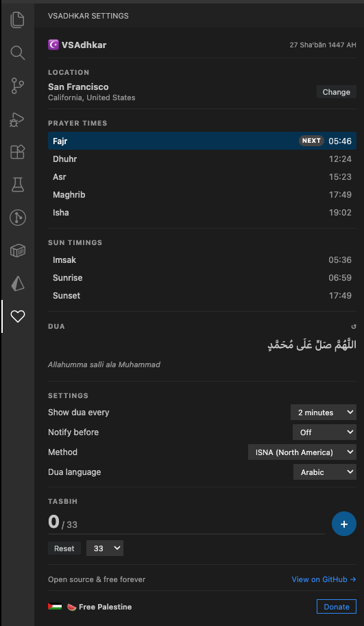

  

# VSAdhkar

**VSAdhkar** is a Visual Studio Code extension designed for developers who want to stay spiritually connected throughout their workday. It brings daily **Adhkar** (Islamic remembrances) and **Dua** (supplications) directly into your coding environment via timely notifications.

Stay mindful and grounded without leaving your IDE.

---

## ✨ Features

- 🕋 **Prayer Time Notifications**: Stay updated with accurate prayer times based on your location.
- 📿 **Daily Adhkar & Dua**: Receive periodic notifications with essential morning, evening, and general supplications.
- 📍 **Location Auto-Detection**: Automatically detects your city and country to provide precise prayer timings.
- ⚙️ **Customizable Settings**: Adjust notification intervals, calculation methods, and manually set your location through a dedicated sidebar.
- 🖱️ **Status Bar Integration**: Quickly access a daily Dhikr with a single click from the VS Code status bar.
- 🖥️ **Intuitive Sidebar Panel**: Manage all your preferences in a beautiful, easy-to-use settings view.

## 🚀 Installation

### From VS Code Marketplace
1. Open **Visual Studio Code**.
2. Go to the **Extensions** view (Ctrl+Shift+X or Cmd+Shift+X).
3. Search for `VSAdhkar`.
4. Click **Install**.

### From Source
1. Clone the repository: `git clone https://github.com/azizbecha/vsadhkar.git`
2. Open the folder in VS Code.
3. Run `npm install` to install dependencies.
4. Press `F5` to start a new VS Code window with the extension loaded.

## 🛠️ Usage

### Getting Started
Once installed, VSAdhkar will attempt to auto-detect your location and start scheduling notifications. You will see a heart icon (`❤`) in the Status Bar.

### Commands
Access VSAdhkar features via the Command Palette (`Ctrl+Shift+P` or `Cmd+Shift+P`):
- `Get Dhikr`: Manually trigger an Adhkar notification.
- `Open VSAdhkar Settings Panel`: Open the configuration sidebar.
- `Select location`: Manually choose your Country, State, and City.
- `Clear all data`: Reset all stored settings.

### Settings Sidebar
Click the Heart icon in the **Activity Bar** (left side) to open the VSAdhkar Settings panel. From here you can:
- Change the **Prayer Calculation Method**.
- Adjust **Notification Intervals** for general Adhkar.
- View your current location and sync prayer times.

## ⚙️ Configuration

VSAdhkar supports multiple prayer calculation methods to suit your region:
- Muslim World League
- ISNA (North America)
- Egyptian Authority
- Umm Al-Qura (Makkah)
- University of Islamic Sciences, Karachi
- Institute of Geophysics, University of Tehran
- Gulf Region
- Kuwait
- Qatar
- Majlis Ugama Islam Singapura, Singapore
- Union Organization islamic de France
- Diyanet İşleri Başkanlığı, Turkey
- Spiritual Administration of Muslims of Russia

## 🤝 Contributing

Contributions are welcome! If you have suggestions or find bugs, feel free to open an issue or submit a pull request.

1. Fork the Project.
2. Create your Feature Branch (`git checkout -b feature/AmazingFeature`).
3. Commit your Changes (`git commit -m 'Add some AmazingFeature'`).
4. Push to the Branch (`git push origin feature/AmazingFeature`).
5. Open a Pull Request.

## 📄 License

Distributed under the MIT License. See `LICENSE` for more information.

---

Developed with ❤️ by [Aziz Becha](https://github.com/azizbecha)
